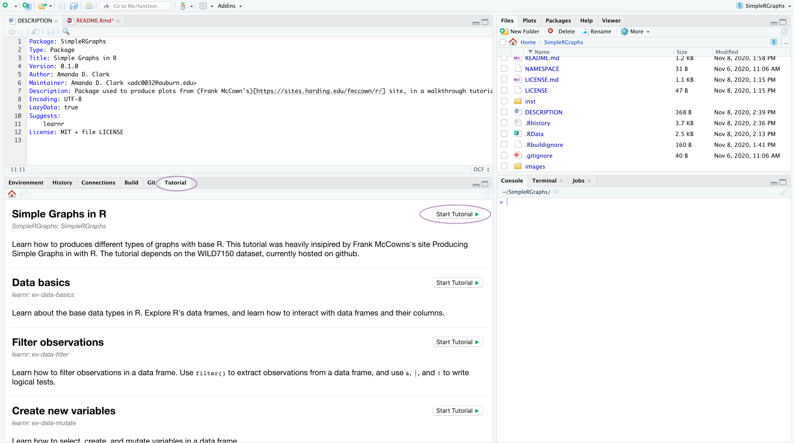

# Activity #2: Practice Graphing in R

For the lab assignment, you will use the [SimpleRGraphs](https://github.com/adc0032/SimpleRGraphs) tutorial to walk through introductory graphics in R. 
When you are finished, you should feel confident making graphs in R. 

## Learning Objectives:
* Learn to create different graphs using basic R functions
  * Line Graphs
  * Bar Graphs
  * Pie Graphs
  * Histograms
  * Dot Graphs
* Learn to manipulate and customize graphs created with base R
* Apply rendering methods from video walkthroughs to create a PDF of graphs

## Installation

This tutorial was built in and works within Rstudio.
**Mac users will need [Xcode developer tools](https://mac.r-project.org/tools/) from the App store and Windows users will need [Rtools](https://cran.r-project.org/bin/windows/Rtools/) from CRAN in order to use `devtools`**. 
Once this dependency is installed, follow the steps below to download and set-up the SimpleRGraph tutorial.  

**First**: Install and load `learnr` (create your own using the [learnr documentation](https://rstudio.github.io/learnr/index.html)!):

```r
install.packages("learnr") # Run this install line ONCE
library(learnr)
```

**Second**: Install and load devtools, and download the development version of SimpleRGraphs from [GitHub](https://github.com/adc0032/SimpleRGraphs) with devtools:

``` r
install.packages("devtools") # Run the install line ONCE
library(devtools)
devtools::install_github("adc0032/SimpleRGraphs") # Run the install line ONCE
```


**Third**: Download the accompanying simulated data package from [GitHub](https://github.com/adc0032/WILD7150):

```r
devtools::install_github("adc0032/WILD7150") # Run the install line ONCE
```

A final dependency is `tidyverse`, but you should be prompted to install it, if you do not have it installed. 

## Running

SimpleRGraphs can be run in a web broswer (Google Chrome) OR interactively in RStudio.

To start the tutorial **in a web browser**, run the following command in your RStudio console:

```r
learnr::run_tutorial("simplergraphs", package = "SimpleRGraphs")
```

To start the tutorial **in an RStudio Window**:

Use the "Tutorial" tab to access "Simple Graphs in R" by clicking **Start Tutorial**


## Next page:
[Advanced Statistical Concepts in R](https://github.com/StevisonLab/R-Mini-Course/blob/main/Advanced%20Stats%20Concepts.md)
