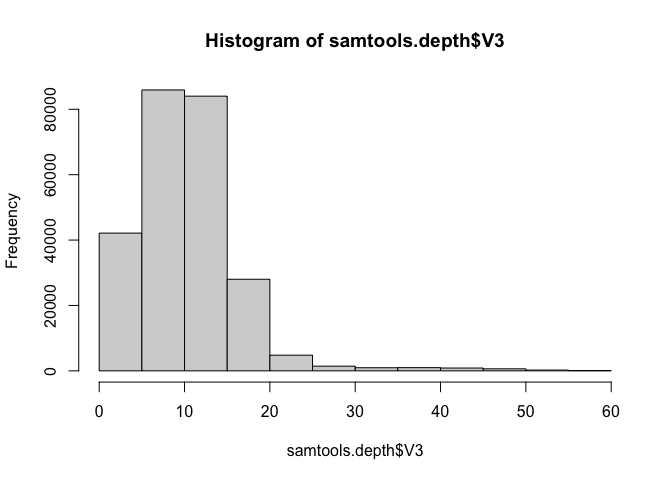
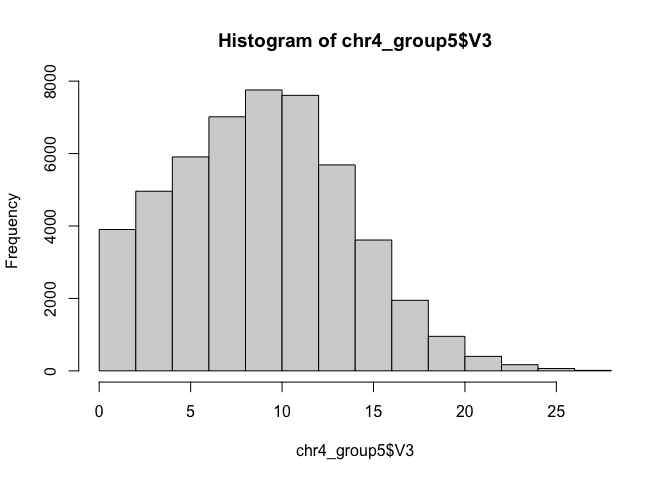
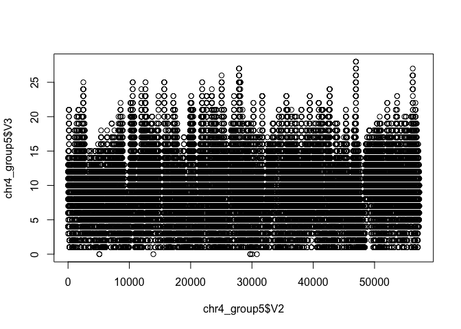
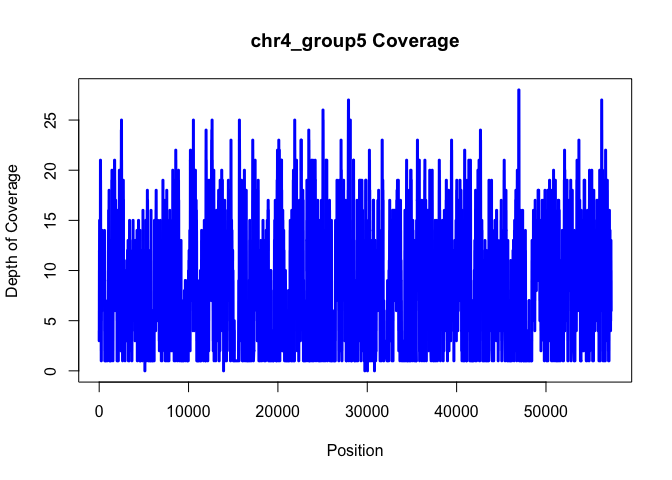

Key for Activity 1
================
Laurie Stevison

## Handout Review

## Steps 1-3: Download and unzip input file provided.

- Make a folder for this exercise.
- Set the working directory to that folder.
- Open an RScript and save it as coverage.R.
- Save the script as you go so you can re-run this exercise anytime you
  want!

## Step 4a: read in data

``` r
#samtools.depth=read.table(file="../raw_data/chr4.depth.out")
#View(samtools.depth)

samtools.depth <- readRDS("data/activity1_data.rds")
```

## Step 4b: test functions head, tail and length on your data frame.

``` r
head(samtools.depth)
```

    ##            V1 V2 V3
    ## 1 chr4_group1  2  1
    ## 2 chr4_group1  3  2
    ## 3 chr4_group1  4  2
    ## 4 chr4_group1  5  2
    ## 5 chr4_group1  6  2
    ## 6 chr4_group1  7  2

``` r
tail(samtools.depth)
```

    ##                 V1    V2 V3
    ## 249995 chr4_group5 57294  8
    ## 249996 chr4_group5 57295  7
    ## 249997 chr4_group5 57296  7
    ## 249998 chr4_group5 57297  7
    ## 249999 chr4_group5 57298  6
    ## 250000 chr4_group5 57299  6

``` r
length(samtools.depth)
```

    ## [1] 3

*Were you surprised by the output of length?*

## Step 4c: redo length calculation on vector `V1`:

``` r
length(samtools.depth$V1)
```

    ## [1] 250000

*Each column in this file is a vector (default labeled `V1..V3`). By
specifying a single vector within the data frame we get a length
calculation that matches the environment tab information.*

## Step 4d: make new variables/objects by extracting rows and columns in this dataset:

``` r
col3=samtools.depth[,3]
row19=samtools.depth[19,]
cell3_19=samtools.depth[19,3]
```

## Step4e: repeat `head`, `tail`, and `length` on the new objects:

``` r
head(col3)
```

    ## [1] 1 2 2 2 2 2

``` r
tail(row19)
```

    ##             V1 V2 V3
    ## 19 chr4_group1 20  3

``` r
length(col3)
```

    ## [1] 250000

## Step 4f: Subset a single contig, `chr4_group5`:

``` r
chr4_group5=subset(samtools.depth,V1=="chr4_group5")
```

## Step 4g: Repeat on another contig:

``` r
#figure out the name of another contig:
unique(samtools.depth$V1)
```

    ## [1] "chr4_group1" "chr4_group2" "chr4_group3" "chr4_group4" "chr4_group5"

``` r
#we've already subsetted chr4_group5, so let's subset chr4_group2:
chr4_group2=subset(samtools.depth,V1=="chr4_group2")
```

## Step 5a & b: calculate mean and standard deviation for coverage:

``` r
#mean
mean(samtools.depth$V3)
```

    ## [1] 10.80083

``` r
#sd
sd(samtools.depth$V3)
```

    ## [1] 6.152665

``` r
#5c: do this again on your subsetted contig:
mean(chr4_group5$V3)
```

    ## [1] 9.38386

``` r
sd(chr4_group5$V3)
```

    ## [1] 4.758181

*What are some reasons you would expect coverage to be different in one
contig or one region of a chromosome as compared to the whole genome?*

## Step 6a & b: make a histogram of both data frames:

A histogram shows the frequency of each coverage level throughout our
dataset.

``` r
#full dataset
hist(samtools.depth$V3)
```

<!-- -->

``` r
#subsetted contig only
hist(chr4_group5$V3)
```

<!-- -->

*Again, what are some reasons you would expect the distribution of
coverage to be different in one contig or one region of a contig as
compared to the whole genome?*

## Step 6c: plot coverage along the contig:

Read about the command plot in help and work to make your graph look
nice by adding color, a title and names for the axes that are more
informative than the defaults.

``` r
#use function plot:
plot(chr4_group5$V2,chr4_group5$V3)
```

<!-- -->

``` r
#some steps to make it look nice:
plot(chr4_group5$V2,chr4_group5$V3,xlab="Position",ylab="Depth of Coverage",main="chr4_group5 Coverage",type="l",lwd=3,col="blue")
```

<!-- -->

*Note I’ve added a title, labeled each axis and colored the line. What
changes did each of you make?*
