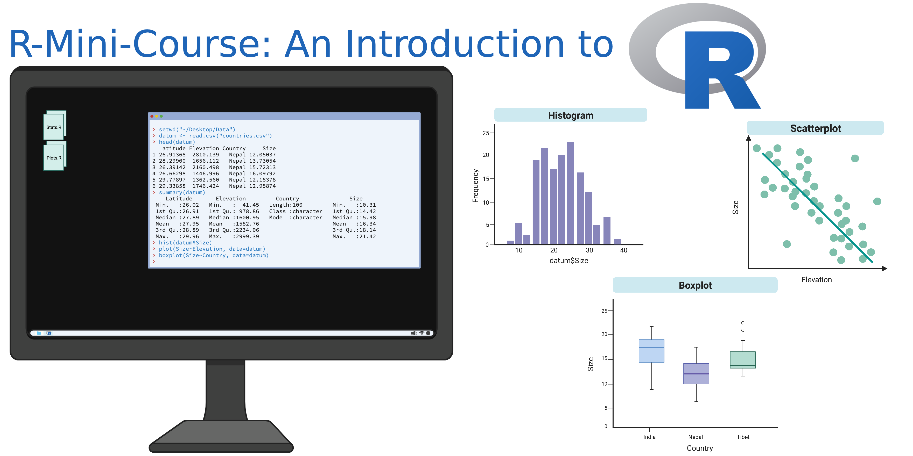

R-Mini-Course
================

In this mini course, we will explore the programming language and
environment [R](https://www.r-project.org/). We will integrate R with
command line towards the end of this course to show you how to use R
within shell scripts and execute R code via an HPC, using the [Alabama
Supercomputer](https://www.asc.edu/) as an example.

To use R, we will be mainly working within the GUI environment of
RStudio. Although R can be run and loaded from the command line, RStudio
includes a set of integrated tools designed to help you be more
productive with R, such as a console, syntax-highlighting editor that
supports direct code execution, tools for plotting, history, debugging
and workspace management. This is also known as an IDE or integrated
development environment.

The content is meant to be self-guided, with several walk through
tutorial lecture videos, as well as exercises to practice on your own.
Still, it is worth noting that this mini course is designed for
**complete novices** to R! Each of the 7 modules will go at a slow pace
with lots of repetition and call backs to previous module videos. Each
module has specific learning objectives listed so you know what to
expect. This can be completed at your own pace - over 3 days or 3
months - whatever works best for you! And feel free to skip some
modules - you do NOT have to do every one of these.

## Getting Started

### Materials and Resources to Get you started!

We have generated this tutorial as an R Project, which means it contains
all of the input data, scripts, and outputs in a single place. Using R
Projects is a wise practice and more importantly, it is a **reproducible
practice**. All script files (with the exception of R Notebooks) have
paths automatically set relative to the R Project directory.

**Clone this repository** and generate your R Notebooks or R Scripts for
each module inside of the existing R Project directory. You *should be
able to use relative paths* when referencing saved data objects provided
with the package (R Notebook paths will be relative to the location the
notebook is saved). [Click to learn more about the benefits, creation,
and maintenance of an R
Project.](https://support.rstudio.com/hc/en-us/articles/200526207-Using-RStudio-Projects)

[R
Cheatsheet](http://github.com/rstudio/cheatsheets/raw/master/base-r.pdf) -
Print this out and keep in your workspace as you are learning. More
cheatsheets as you get more advanced can be found
[here](https://www.rstudio.com/resources/cheatsheets/).

We have found two great R tutorials. There are SO many out there, that
we just couldn’t decide, so we have provided you with two options - one
that you would need to download and can do within RStudio on your
computer. Alternatively, you can complete the web-based one we were able
to find. EITHER should be sufficient to get you started with the basics.

- R tutorials:
  - Downloadable via [swirl](https://swirlstats.com/students.html):
    - Install the swirl package.
    - Run `swirl::install_course("The R Programming Environment")` on
      the R console
    - Then launch swirl with the command `swirl()`.
  - [Web-based:
    Tinystats](https://tinystats.github.io/teacups-giraffes-and-statistics/index.html)

### Suggested Reading

A great companion text for learning R that we recomend is the book [R in
Action](https://www.manning.com/books/r-in-action). Suggested readings
will be provided for each topic.

Optional: Alternative to R in Action are several FREE R Textbooks. Two
that we like are: \* [YaRrr! The Pirate’s Guide to
R](https://bookdown.org/ndphillips/YaRrr/)  
\* [Hands-On Programming with
R](https://rstudio-education.github.io/hopr/)

### Learning Objectives

- Practice the art of reproducibility using R scripts
- Become comfortable in the RStudio working environment
- Learn how to conduct basic summary statistics in R
- Learn how to manipulate files in R
- Learn how to perform basic statistical tests in R
- Learn how to use programming constructs in R (e.g. loops,
  conditionals, etc.)
- Learn how to use R on the command line

------------------------------------------------------------------------

## Topics

- [Module 1: Getting Started in the R and RStudio
  Environment](docs/module1.html)
- [Activity \#1: Plotting Coverage Along a
  chromosome](docs/activity1.html)
  - This laboratory exercise can be done after completing a basic R
    tutorial (like one linked above) and watching the getting started
    video above. No other experience needed!
- [Module 2: Basic Summary Statistics in R](docs/module2.html)
- [Module 3: Data manipulation in R](docs/module3.html)
- [Activity \#2: Practice Graphing in R](docs/activity2.html)
- [Module 4: Advanced Graphing in R](docs/module4.html)
- [Module 5: Advanced Statistical Concepts in R](docs/module5.html)
- [Module 6: Programming in R](docs/module6.html)
- [Module 7: Using R on the Command Line](docs/module7.html)
- [Activity \#3: R on a supercomputer - building a pipeline
  script](docs/activity3.html)

Additional resources can be found at [the end](docs/Congrats.html) of
this mini course. This page also includes links to practice data you can
download to continue your R learning.

