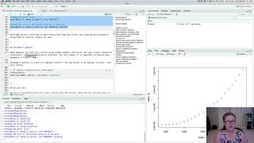

Module 2: Basic Summary Statistics in R
================

Fair warning, we are NOT statisticians. So when we say ‘basic’ we mean
very simple summary statistics to perform initial data exploration. In
Video \#2, you will go through a walkthrough of several data files in R.
Below are some files that will be helpful to download and use as you
walk through the video. You will also be asked to pause or explore data
after the video completes on your own. This step is optional. If you
feel you need a basic refresher on statistics, here is a nice video
review of [Statistics for
Science](https://www.youtube.com/watch?v=jf9VT4V4aRI).

## Video \#2

In this video we will be working with two files in R: `USpop.csv` and
`BodyFat.csv`. Both files are included in the data tarball located in
the `raw_data` directory.

IF you are well practiced with reading data into R, feel free to read in
our existing data object.

Make an R Notebook for this walk through tutorial to save all the code
you will be learning. We will cover:

- Reading in datasets
- Various ways to subset data
- Basic Summary Statistics
  - `mean` and `sd`
  - `range`
  - `summary`
- Exploring data visually
  - Using `hist` function
  - Using `plot` function
- Testing for a statistial correlation

### Walk-through code

- [R Markdown from video
  (Slideshow)](docs/4.02.Basic_Summary_Statistics_in_R.html)

### Data Files

- USPop.csv
- BodyFat.csv

**Associated code and data files are also within the compressed data
file.**

## Recommended R in Action Readings that cover the material in this video:

- Chapter 2: pgs. 20-45
- Parts of Chapter: 7.1.1: 138-139; 7.2.2: 151-152; 7.3 Correlations
  pgs: 153-158

## Recommended Follow Up:

- To better understand the statistics behind a Pearson’s correlation
  test, here is a [simple
  video](https://www.youtube.com/watch?v=lVOzlHx_15s) that covers this
  topic in more depth. Note, it is beyond the scope of this course to
  distinguish between different correlation methods, but you may be
  interested in researching the Spearman’s correlation test as an
  alternative method, which has different statistical assumptions than
  the Pearson’s correlation test.
- While the walk-through and the above video cover correlation, the walk
  through also revisits p-values, which you may already be familiar
  with. Still, if you want a good refresher from a more statistical
  perspective, we find [this video on the Chi-Square
  test](https://www.youtube.com/watch?v=WXPBoFDqNVk&t=40s) to be very
  helpful. Although it is not specific to statistical correlation tests,
  it still helps to reinforce some of the statistical concepts covered
  in the walk through video.
- A similar video, which covers the [Student’s
  t-test](https://www.youtube.com/watch?v=pTmLQvMM-1M) is also helpful
  in reviewing a concept not covered here, but that you might need to
  use in R. The video uses excel, but this is quite simple to implement
  in R as well.

## Next page:

[Module 3: Data manipulation in R](docs/module3.md)
