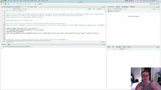

This walk-through will lead into the last self-guided activity where we scale up by taking the R scripts we've been making in RStudio to the command line. Throughout the video, I refer to Labs 7 and 9. 

For the purposes of this mini course, **Lab 7 == Activity #1 and Lab 9 == Activity #3.** 

First, you will clean up the coverage.R script from Activity #1 to incorporate loess smoothing and run in the terminal on a super computer. This video also talks about using loess functions to make consistent smoothing across inputs of varying sizes (such as chromosomes). 

Since this module relies on some experience in the shell environment, if you don't have any, you can skip this topic as well as the last activity and wrap up with Programming in R. If you want to try your hat at this, see additional resources below for some linux starting points.

## Video # 7

While so far we've worked with smaller datasets, the scripts you've been using can be used to on an HPC in a loop similar to any other type of data processing. To see how this scale up works, you will learn how to  execute R code within the shell environment. This is key to being able to use a super computer to run R when running complex statistical models or working with larger datasets. We will revisit the code from the first activity and add in a smoothing function called `loess`. 

### Walk-through code

* [R Markdown from video (Slideshow)](http://htmlpreview.github.io/?https://github.com/StevisonLab/R_Mini_Course/blob/main/modules/Module_6/4.05.R_on_CL.html) 
* Walkthrough R Script

### Data files

* chrX.depth.out.zip

**Associated code and data files are also within the compressed data file.**

### Output Graphics

* [chrXL_group3b.png](../../images/chrXL_group3b.png)
* [chrXL_group3b.smoothed.png](../../images/chrXL_group3b.smoothed.png)

**Associated code and data files are within the compressed data file.**

## Recommended R in Action Readings that cover the material in this video:
* Chapter 11 "Intermediate Graphics" covers `loess`. Chapter 19 on Advanced Graphics covers smoothed lines, but using `ggplot2` instead of base R as shown here. 

# Additional Resources:
Since this page relies on some experience in the shell environment, if you don't have any, you can skip this topic and the last activity and wrap up with Programming in R. Alternatively, there are lots of command line intros out there to get you started. Here is one of my favorite [linux cheatsheets](https://ubuntudanmark.dk/filer/fwunixref.pdf).

## Next page:

[Module 7: Programming in R](https://github.com/StevisonLab/R_Mini_Course/blob/main/modules/Module_7/module7.md)
