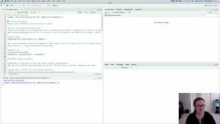

In this module, we will be extending our knowledge of programming constructs (i.e., like the for-loops we covered in module 3).

## Video # 6

In this video, we will use data from my own lab to learn how to do two new programming constructs in R that improve the readability, reproducibility, and control flow of your code. 

IF you are well practiced with reading data into R, feel free to read in our existing data objects. 

Make an R Notebook for this walk-through tutorial to save all the code you will be learning. We will cover:

* functions
* if-else statements

### Walk-through code

* [R Markdown from video (Slideshow)](http://htmlpreview.github.io/?https://github.com/StevisonLab/R_Mini_Course/blob/main/modules/Module_7/4.06.Programming_in_R.html) 
* Walkthrough R Script

### Data files

* Exp5_rawdata.csv

**Associated code and data files are also within the compressed data file.**

## Recommended R in Action Readings that cover the material in this video:
* Parts of Chapter 20 on Advanced Programming, 
  * Section 1.2 Control Structures pgs: 470-472
  * Section 1.3 Creating functions pgs: 473-474

## Next page:
[Activity 3: R on a supercomputer](https://github.com/StevisonLab/R_Mini_Course/blob/main/modules/Activity_3/activity3.md)

