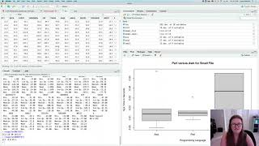

Again, I want to reiterate that we are NOT statisticians. So the concepts we will be covering are still pretty basic, but start to get into HOW to do some more advanced statistical tests and how to plot those results. We still strongly encourage consulting a statistician for which specific statistics are appropriate for YOUR analysis.

## Video #5

In this video, we will delve into how to load more complex data into R and make boxplots using categorical data. We will revisit the body fat data discussed in some of the last few videos. We will also look at data from a class I teach in linux where students compare perl and awk sytem run times for parsing VCF files. Finally, you will learn how to fit your data to statistical models in R.

IF you are well practiced with reading data into R, feel free to read in our existing data objects. 

Make an R Notebook for this walk through tutorial to save all the code you will be learning. We will cover:

* Practice reading in datasets with more complexity
* Making boxplots of factor data
* Subsetting data in different ways
* Fitting data to statistical models
    + 1 way ANOVA using `aov`
    + Generalized linear model using `glm`

## Walk-through code

* [R Markdown from video (Slideshow)](docs/4.04.Advanced_Statistical_Concepts_in_R.html) 
* Walkthrough R Script

## Data Files

* BodyFat.csv
* Lab6_Perl_v_Awk.csv

**Associated code and data files are also within the compressed data file.**

## Recommended R in Action Readings that cover the material in this video:
* Chapter 4.10 Subsetting datasets
* Chapter 6.5 Box Plots
* Chapter 9, sections 1-3 on fitting statistical models

## Next page:

[Activity \#2: Practice Graphing in R](docs/activity2.html)
