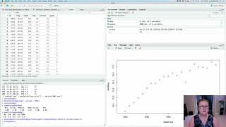

Module 3: Data manipulation in R
================

Learn to bin, transform and add new vectors to datasets in R. You will
also install and load packages to build a map using coordinate data.

## Video #3

For this video we will be working with the `USpop.csv` dataset again.

IF you are well practiced with reading data into R, feel free to read in
our existing data object.

Make an R Notebook for this walk through tutorial to save all the code
you will be learning. We will cover:

-   Adding new vectors to datasets
-   Numeric versus character values
-   for loops in R
-   transformations
-   binning data
-   using `maps` to plot points on a map
-   Splitting datasets into quantiles

### Walk-through code

-   [R Markdown from video
    (Slideshow)](http://htmlpreview.github.io/?https://github.com/StevisonLab/R_Mini_Course/blob/main/modules/Module_3/4.03.Data_Manipulation_in_R.html)

### Data Files

-   USPop.csv

**Associated code and data files are also within the compressed data
file.**

## Recommended R in Action Readings:

-   Chapter 1.4: pgs. 15-16
-   Chapter 2: pgs. 20-45

## Next page:

[Activity #2: Practice Graphing in
R](https://github.com/StevisonLab/R_Mini_Course/blob/main/modules/Activity_2/Activity2.md)
