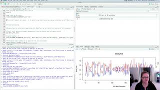

Module 5: Advanced Graphing in R
================

This video covers some more advanced plotting skills (expected to follow
Activity \#2 where you learn basic skills on your own). You will learn
how to plot on two y-axes, write plots to a file, and make multi-panel
plots. We will once again revisit the body fat data.

## Video \#4

For this video we will be working with the `BodyFat.csv` dataset again.

IF you are well practiced with reading data into R, feel free to read in
our existing data object.

Make an R Notebook for this walk through tutorial to save all the code
you will be learning. We will cover:

- Adding text to plots
- Plotting on multiple Axes
- Adding figure legends
- Making multi-panel plots
- Adjusting figure margins
- Writing images to a file
- Paralleling base R code to `ggplot2` syntax to accomplish the same
  goals

### Walk-through code

- [R Markdown from video
  (Slideshow)](http://htmlpreview.github.io/?https://github.com/StevisonLab/R_Mini_Course/blob/main/modules/Module_5/5.03.Advanced_Graphing_in_R.html)

### Data Files

- BodyFat.csv

### Output PDF

- [Body_Fat.PDF](https://github.com/StevisonLab/R_Mini_Course/blob/main/data/Body_Fat.pdf)

**Associated code and data files are also within the compressed data
file.**

## Recommended R in Action Readings:

- Chapter 3: Getting Started with Graphs

## Next page:

[Module 6: Using R on the Command
Line](https://github.com/StevisonLab/R_Mini_Course/blob/main/modules/Module_6/module6.md)
